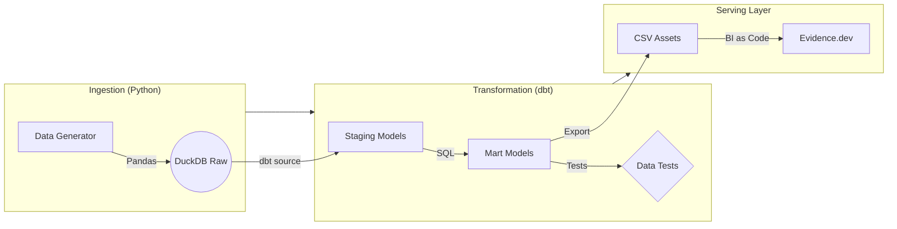

# 📊 Antigravity Analytics: Modern Data Stack Demo

[](https://github.com/nodo123456/antygravity_test/actions)

A production-grade "Modern Data Stack" built entirely on open-source technologies. This project demonstrates an end-to-end **ELT (Extract, Load, Transform)** pipeline, Analytics Engineering best practices, and automated CI/CD deployment.

**[🚀 View Live Dashboard](https://nodo123456.github.io/antygravity_test/)**

## 🏗 Architecture

The project follows a "Lakehouse-in-a-Box" architecture, running entirely within GitHub Actions runners.



## 🛠 Technologies
 This project leverages the bleeding edge of the Modern Data Stack:

*   **[DuckDB](https://duckdb.org/)**: An in-process SQL OLAP database management system. Used here for high-performance local data processing and transformation. (Emulates a data warehouse like BigQuery or Redshift)
*   **[dbt Core](https://www.getdbt.com/)**: Transformation workflow. Applies software engineering best practices (modularity, testing, version control) to analytics code.
*   **[Evidence.dev](https://evidence.dev/)**: "Business Intelligence as Code". Generates a performant, static data website from markdown and SQL. (Emulates main viz tool like Looker, Tableau)
*   **[Python](https://www.python.org/)**: Orchestration and synthetic data generation validation.
*   **[GitHub Actions](https://github.com/features/actions)**: Fully automated CI/CD pipeline. The entire stack spins up, runs, tests, and deploys on every commit. (Emulates orchestration like Airflow, Prefect)

## 🧠 Methodologies

### Analytics Engineering
*   **Modularity**: Data is modeled in layers (`staging` -> `marts`) to ensure reusability and clarity.
*   **Testing**: Data quality is enforced via dbt tests (unique, not null) before deployment.
*   **Version Control**: All analytic logic is versioned in Git, enabling code review and rollback.

### DevOps & CI/CD
*   **Infrastructure as Code**: The entire pipeline definition lives in `.github/workflows`.
*   **Automated Deployment**: The dashboard is automatically rebuilt and deployed to GitHub Pages daily or on push.
*   **Zero-Maintenance**: By using serverless/static architecture, there are no servers to manage or databases to scale.

## 🏃‍♂️ How to Run

1.  **Clone the repo**:
    ```bash
    git clone https://github.com/nodo123456/antygravity_test.git
    cd antygravity_test
    ```

2.  **Install Dependencies**:
    ```bash
    pip install -r requirements.txt
    cd evidence && npm install
    ```

3.  **Run the Pipeline**:
    ```bash
    python run_pipeline.py
    ```

4.  **View Dashboard**:
    ```bash
    cd evidence && npm run dev
    ```

---
*Built with code, data, and antigravity.*
